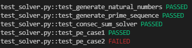
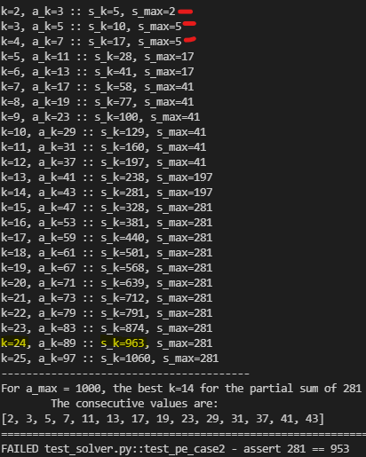
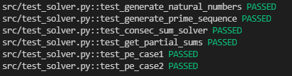
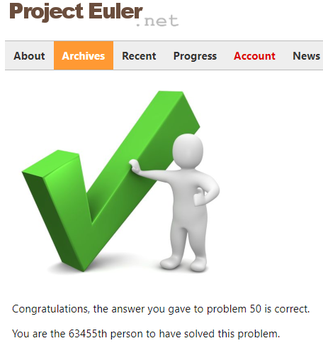

# Project Euler 50
I love Project Euler! It was one of the puzzle sites (besides Rosalind) I found early in my programming days. Especially in late High School and early college, I would work on various PE problems in C or C++ to try to learn algorithms. It is always a good idea to revisit them when you can. I have no idea if I have worked on problem 50 before, so it is fresh enough to try again in Python. I'm also going to try to employ TDD (Test-driven Development) on this quick project, so I learn something regardless.

The full description of the problem can be found on the [problem page](https://projecteuler.net/problem=50) but essentially, I need to write a program that will do the following:

> Which prime number under 1,000,000 is the sum of the most consecutive primes? (Ex: under 100, the answer is 41 = 2 + 3 + 5 + 7 + 11 + 13) 

## 1. Solution Checklist
- [x] Draft algorithm pseudocode for README
- [x] Write Unit tests for example solutions (*a*max = [100, 1000])
- [x] Write algorithm code framework in Python 
- [x] Test the framework using Triangular Sums 
- [x] Create a Prime Number generator
- [x] Run sample problem specific unit tests
- [x] Run algorithm for *a*max = 1,000,000 and submit to PE

## 2. Algorithm Pseudocode
Rather than doing this as my 2012 self would have, let me put "brute force" off the table for now. Sequences can be a pain mathematically, especially when evaluating the convergence of infinite sums of elements. Luckily, everything in this problem is finite. To start off, let us define some variables for the pseudocode:

- Let  represent the maximum value of the consecutive summation. For the test cases, it is 100 or 1000. For the final evaluation, it is 1000000.
- Let  be the sequence of interest (primes for this problem), where *N* satisfies .
- Define the partial sum of the first *k* elements in sequence *A* as . 
 
**Based on the definitions:** We want to find the largest partial sum satisfying  and . Knowing the value of *k* will also tell us what subsequence of *A* was used! While not required for the problem, checking this subsequence will be useful for intuitive checking.

### Pseudocode

0. Initialize  to 100, 1000 or 1000000 depending on the test or evaluation scenario.
1. Initialize the sequence of interest, *A* for  and  for the sequence of primes.
2. Initialize the highest partial sum  for the case *k*=1. 
    - Also initialize 
3. Initialize *k*=2 and 
4. **WHILE** :
    1. Calculate the partial sum 
    2. **IF**  **AND** :
        - Reassign the largest valid partial sum with the *k*th partial sum  
    3. Increment *k* by 1
5. After the while condition fails,  is the largest number in sequence *A* that is the consecutive sum of its elements and is also no more than . **DONE**

Assuming all elements of sequence *A* are positive (which is true for the primes) then the partial sum of *k* elements is always larger than for *j<k*. If  and  are valid elements in sequence *A*, then there is no need to check in the pseudocode if  since that is implied.

**Implementation Note:** Step 0 will be implemented as a list since sequence *A* consists of at most 1,000,000 values. My computer shouldn't shed any tears over this being held in memory. Another possibility is to create the sequence using a Python generator statement. It is still necessary to store the *k*th subsequence of *A*, however.

## Testing the Code
Because the problem has 2 examples with solutions given ( and ), it will be easy to start with unit tests. The algorithm above will be implemented into some function `consec_sum_solver(a_max, A)` which takes the maximum element limit and generated sequence *A* as arguments. The sequence *A* should be generated by another function `generate_prime_sequence(a_max)` that will create elements up to the limit. Unit tests then will verify the following:

- :white_check_mark: Assert `consec_sum_solver(a_max=100, A) = 41`
- :white_check_mark: Assert `consec_sum_solver(a_max=1000, A) = 953`

### Verifying the Algorithm with Natural Numbers
The above unit tests are dependent on the existence of `generate_prime_sequence(a_max)` to create a prime sequence. This is a subtask of this particular Project Euler Problem. I will handle it after I verify the pseudocode algorithm works correctly. As such, I will test the algorithm implemented in `consec_sum_solver(a_max, A)` with a simple, toy sequence--the postive natural numbers 1,2,3...etcetera.

Let  be the sequence of postivie natural numbers up to the maximum . The partial sums of this sequence are known as [Triangular Numbers](https://en.wikipedia.org/wiki/Triangular_number) and have a nice, closed-form expression.

Specifically, the partial sum is: . Hence it is easy to verify that  for the best value of *k** can be analytically derived for easy unit testing.

The following is a quick derivation of the the quadratic relationship to solve:

By re-arranging the terms and completing the square, I arrive at the relationship in yellow. It is easy now to see the visual intuition on what the optimal *k** is:

To guarantee that  is still satisfied and  (i.e. is a natural number), I must apply the floor function to the root of the *k** quadratic. Hence the formula for the triangular numbers solution is:

### Natural Numbers Unit Test
Suppose that , then 91 = 1+2+3+4+...+12+13 is the largest natural number under  that can be written as the sum of consecutive natural numbers in sequence *A*. Using the formula derived above, *k**=13 which leads to the optimal partial sum of 91!

So for the unit test, I can assert the following assuming a very simple `generate_natural_numbers(a_max)` function creates input sequence `A`:

- :white_check_mark: Assert `consec_sum_solver(a_max=100, A) = 91`

After developing the algorithm based on the pseudocode, I tested it using the natural numbers:

It is expected that the prime sequence generator and the two Project Euler sample cases fail. They have not been developed yet. 

## 3. Generating Prime Numbers
Generating a list of prime numbers up to a limit (in this case up to ) is a problem I solved a long time ago when I originally got into Project Euler. In fact, [Problem 7](https://projecteuler.net/problem=7) is very much related to this. Given that the crux of Problem 50 is not generating prime numbers, I will refer back to the algorithms of my youth:

1. Building a list of primes with [Trial Division](https://en.wikipedia.org/wiki/Trial_division) and a square root heuristic
2. Building a list of primes with the [Sieve of Eratosthenes](https://en.wikipedia.org/wiki/Sieve_of_Eratosthenes)

The Sieve method seems like a method to use for this Problem 50. In the interest of space, I won't repeat the sieve algorithm here. Please see the `pe50.sequences` code for its implementation. 

After developing the Sieve code, my tests run a bit better:

I now pass `test_generate_prime_sequence`, which was intended, as well as the first case of the Problem 50 examples--`test_pe_case1`. All that's left is to get the second example working and then run it for .

## 4. Getting Case 2 to Work
It is very strange that Case 1 works but Case 2 does not. To investigate this further, I added in some more verbose print statements to the solver function. It's result on the failed test is:

Consider the second case again:

> The longest sum of consecutive primes below one-thousand that adds to a prime, contains 21 terms, and is equal to 953.

What is strange from the print out is that 963 is the partial sum that is closest to 953, but is 10 over and thus not in the primes sequence. Additionally, 963 is the partial sum for *k*=24. The prompt mentions that there are 21 terms...so...if I take out the first 3 terms [2,3,5] I get a 21 term subsequence that sums to 953. 

This means that my understanding of the problem is not accurate and the pseudocode above doesn't apply. If you've read this far then I assure you I am swearing enough for the both of us. Anyways, onwards and upwards.

## 5. Rethinking the Problem
**Goal**: The longest sum of consecutive primes that is still a prime and is under . 

A solution with the most terms in the sum will consequently be a larger number given a sequence of primes. Hence, my original focus of finding the largest prime under  that is a partial sum of the primes sequence. This is close, but I over constrained myself. Specifically, my partial sum method assumes that the subsequence to sum over is . This worked for Case 1 where 41 is the answer. But this did not work for Case 2, where the the 21 term subsequence only added to 712 instead of 953.

The difference that I noticed was that if I had summed the primes from  to , I get 21 consecutive terms that sum to 953--which is the largest prime under 1000 for Case 2.

With that in mind, I will modify my definition of a subsequence to include the starting point as a parameter: . The starting point is . A successful solution will make sure  since increasing *j* reduces the number of terms available in the sum.

If *j* reduces the number of terms for the partial sum, why increase it at all? For the case of the 24th partial sum , the first 3 elements in the sequence are causing the partial sum to shoot above the target 953. So increasing *j*=1 to *j=4* finds a subsequence  that sums up to a prime. 

For notation's sake, I will represent this new partial sum as  .

### New Algorithm Intuition
Intuitively, the process is to start with the highest partial sum . If  is not already a prime (i.e. ), then increment *j* to recompute . Continue this process until  is prime or *j*=*k*. If the latter condition is true, there was no way to create a subsequence that sums to a prime. In that case, decrease *k* and search again. In the case where  is prime, keep track of the result. There may be a lower partial sum that has a longer consecutive sum of elements that is prime. The goal is to find the largest sequence  whose length is *k-j+1*.  

I will develop the algorithm in code first and then capture the exact pseudocode here in the README. A couple of important things standout:

- Assuming a prime partial sum, , exists for some *j*, it comes down to searching across values of j. Perhaps there is a cleaner search process than a linear sweep?
- Because each search step for *j* relies on recomputing , it may be helpful to cache partial sum values. In fact, the partial sum  can be composed of two partial sums--one for the entire sequence using 1 to *k* and another for 1 to *j-1*. The latter sum is thrown away as *j* increases. Hence,  based on the initial definition of partial sums starting from *i*=1.

I will start with a linear sweep of *j*, though if it runs too slowly for large , I will optimize it. Additionally, I will calculate and cache all partial sums  for easy lookup.

**Unit Testing Note:** I will not test the new algorithm on the Natural Numbers case since any sum of natural numbers is still a natural number. This represents a trivial case for the algorithm and it will not represent my algorithm's future success of a sequence of primes.

### New Algorithm Implementation:
The algorithm intuition above proved to be mostly correct! I will highlight any significant additions or deviations here, but please check the implementation of `consec_sum_solver2(a_max, A, verbose=False)` in the `pe50.solver` module.

- Added a `searched_k = []` list to store which values of *k* have been searched already. This search space fills up as the while loop runs
- I stored the current candidate solution as `best_prime` but only updated it when  and the number of terms (*k-j+1*) was better than the current highest number of terms, `best_n_terms`.
- Initially, my algorithm stopped once it found the first value of k for which a subsequence *j*-->*k* was prime. This didn't necessarily imply that `best_n_terms` was the highest for all values of *k*!
    - Because 953 is so close to 1000, this algorithm heuristic worked well and Case 2's test passed
    - The example for Case 1 of `best_prime=41` and `best_n_terms=6` failed with this heuristic. This is because 83 could be written as 11+13+17+19+23, which is the highest value primes under 100, but it was composed of only 5 terms, instead of 6. 
- To correct the search-stopping heuristic, I simply let the while loop exhaust the search space for *k*. I shall see if this needs optimization for ...

After finishing the implementation, I see the blessed 100% all green on the tests!

## 6. Solution Verification
After the tests passed, I updated `main.py` to finally assemble the sequence of 1,000,000 primes and solving the problem. The Sieve algorithm to generate the sequence of primes took a while to operate, but that wasn't the crux of this problem. Below is the coveted green checkmark of Project Euler:

If you don't want to spoil the answer, don't click into the following details:

    
Solution Print Out

        The largest consecutive sum prime is <b>997651</b> with <b>543</b> terms.

        The terms are the following: [7, 11, 13, 17, 19, 23, 29, 31, 37, 41, 43, 47, 53, 59, 61, 67, 71, 73, 79, 83, 89, 97, 101, 103, 107, 109, 113, 127, 131, 137, 139, 149, 151, 157, 163, 167, 173, 179, 181, 191, 193, 197, 199, 211, 223, 227, 229, 233, 239, 241, 251, 257, 263, 269, 271, 277, 281, 283, 293, 307, 311, 313, 317, 331, 337, 347, 349, 353, 359,367, 373, 379, 383, 389, 397, 401, 409, 419, 421, 431, 433, 439, 443, 449, 457, 461, 463, 467, 479, 487, 491, 499, 503, 509, 521, 523, 541, 547, 557, 563, 569, 571, 577, 587, 593, 599, 601, 607, 613, 617, 619, 631, 641, 643, 647, 653, 659, 661, 673, 677, 683, 691, 701, 709, 719, 727, 733, 739, 743, 751, 757, 761, 769, 773, 787, 797, 809, 811, 821, 823, 827, 829, 839, 853, 857, 859, 863, 877, 881, 883, 887, 907, 911, 919, 929, 937, 941, 947, 953, 967, 971, 977, 983, 991, 997, 1009, 1013, 1019, 1021, 1031, 1033, 1039, 1049, 1051, 1061, 1063, 1069, 1087, 1091, 1093, 1097, 1103, 1109, 1117, 1123, 1129, 1151, 1153, 1163, 1171, 1181, 1187, 1193, 1201, 1213, 1217, 1223, 1229, 1231, 1237, 1249, 1259, 1277, 1279, 1283, 1289, 1291, 1297, 1301, 1303, 1307, 1319, 1321, 1327, 1361, 1367, 1373, 1381, 1399, 1409, 1423, 1427, 1429, 1433, 1439, 1447, 1451, 1453, 1459, 1471, 1481, 1483, 1487, 1489, 1493, 1499, 1511, 1523, 1531, 1543, 1549, 1553, 1559, 1567, 1571, 1579, 1583, 1597, 1601, 1607, 1609, 1613, 1619, 1621, 1627, 1637, 1657, 1663, 1667, 1669, 1693, 1697, 1699, 1709, 1721, 1723, 1733, 1741, 1747, 1753, 1759, 1777, 1783, 1787, 1789, 1801, 1811, 1823, 1831, 1847, 1861, 1867, 1871, 1873, 1877, 1879, 1889, 1901, 1907, 1913, 1931, 1933, 1949, 1951, 1973, 1979, 1987, 1993, 1997, 1999, 2003, 2011, 2017, 2027, 2029, 2039, 2053, 2063, 2069, 2081, 2083, 2087, 2089, 2099, 2111, 2113, 2129, 2131, 2137, 2141, 2143, 2153, 2161, 2179, 2203, 2207, 2213, 2221, 2237, 2239, 2243, 2251, 2267, 2269, 2273, 2281, 2287, 2293, 2297, 2309, 2311, 2333, 2339, 2341, 2347, 2351, 2357, 2371, 2377, 2381, 2383, 2389, 2393, 2399, 2411, 2417, 2423, 2437, 2441, 2447, 2459, 2467, 2473, 2477, 2503, 2521, 2531, 2539, 2543, 2549, 2551, 2557, 2579, 2591, 2593, 2609, 2617, 2621, 2633, 2647, 2657, 2659, 2663, 2671, 2677, 2683, 2687, 2689, 2693, 2699, 2707, 2711, 2713, 2719, 2729, 2731, 2741, 2749, 2753, 2767, 2777, 2789, 2791, 2797, 2801, 2803, 2819, 2833, 2837, 2843, 2851, 2857, 2861, 2879, 2887, 2897, 2903, 2909, 2917, 2927, 2939, 2953, 2957, 2963, 2969, 2971, 2999, 3001, 3011, 3019, 3023, 3037, 3041, 3049, 3061, 3067, 3079, 3083, 3089, 3109, 3119, 3121, 3137, 3163, 3167, 3169, 3181, 3187, 3191, 3203, 3209, 3217, 3221, 3229, 3251, 3253, 3257, 3259, 3271, 3299, 3301, 3307, 3313, 3319, 3323, 3329, 3331, 3343, 3347, 3359, 3361, 3371, 3373, 3389, 3391, 3407, 3413, 3433, 3449, 3457, 3461, 3463, 3467, 3469, 3491, 3499, 3511, 3517, 3527, 3529, 3533, 3539, 3541, 3547, 3557, 3559, 3571, 3581, 3583, 3593, 3607, 3613, 3617, 3623, 3631, 3637, 3643, 3659, 3671, 3673, 3677, 3691, 3697, 3701, 3709, 3719, 3727, 3733, 3739, 3761, 3767, 3769, 3779, 3793, 3797, 3803, 3821, 3823, 3833, 3847, 3851, 3853, 3863, 3877, 3881, 3889, 3907, 3911, 3917, 3919, 3923, 3929, 3931]

  

