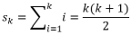
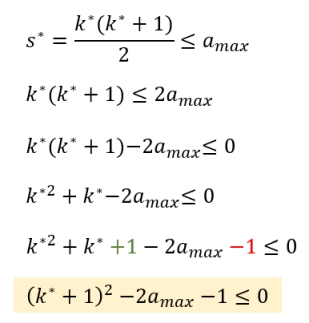
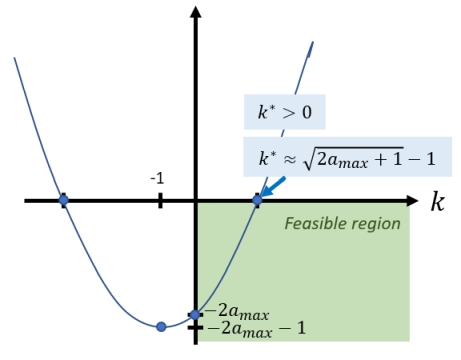
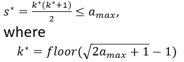
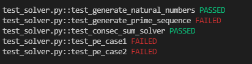

# Project Euler 50
I love Project Euler! It was one of the puzzle sites (besides Rosalind) I found early in my programming days. Especially in late High School and early college, I would work on various PE problems in C or C++ to try to learn algorithms. It is always a good idea to revisit them when you can. I have no idea if I have worked on problem 50 before, so it is fresh enough to try again in Python. I'm also going to try to employ TDD (Test-driven Development) on this quick project, so I learn something regardless.

The full description of the problem can be found on the [problem page](https://projecteuler.net/problem=50) but essentially, I need to write a program that will do the following:

> Which prime number under 1,000,000 is the sum of the most consecutive primes? (Ex: under 100, the answer is 41 = 2 + 3 + 5 + 7 + 11 + 13) 

## Solution Checklist
- [x] Draft algorithm pseudocode for README
- [x] Write Unit tests for example solutions (*a*max = [100, 1000])
- [x] Write algorithm code framework in Python 
- [x] Test the framework using Triangular Sums 
- [ ] Create a Prime Number generator
- [ ] Run sample problem specific unit tests
- [ ] Run algorithm for *a*max = 1,000,000 and submit to PE

## Algorithm Pseudocode
Rather than doing this as my 2012 self would have, let me put "brute force" off the table for now. Sequences can be a pain mathematically, especially when evaluating the convergence of infinite sums of elements. Luckily, everything in this problem is finite. To start off, let us define some variables for the pseudocode:

- Let  represent the maximum value of the consecutive summation. For the test cases, it is 100 or 1000. For the final evaluation, it is 1000000.
- Let  be the sequence of interest (primes for this problem), where *N* satisfies .
- Define the partial sum of the first *k* elements in sequence *A* as . 
 
**Based on the definitions:** We want to find the largest partial sum satisfying  and . Knowing the value of *k* will also tell us what subsequence of *A* was used! While not required for the problem, checking this subsequence will be useful for intuitive checking.

### Pseudocode

0. Initialize  to 100, 1000 or 1000000 depending on the test or evaluation scenario.
1. Initialize the sequence of interest, *A* for  and  for the sequence of primes.
2. Initialize the highest partial sum  for the case *k*=1. 
    - Also initialize 
3. Initialize *k*=2 and 
4. **WHILE** :
    1. Calculate the partial sum 
    2. **IF**  **AND** :
        - Reassign the largest valid partial sum with the *k*th partial sum  
    3. Increment *k* by 1
5. After the while condition fails,  is the largest number in sequence *A* that is the consecutive sum of its elements and is also no more than . **DONE**

Assuming all elements of sequence *A* are positive (which is true for the primes) then the partial sum of *k* elements is always larger than for *j<k*. If  and  are valid elements in sequence *A*, then there is no need to check in the pseudocode if  since that is implied.

**Implementation Note:** Step 0 will be implemented as a list since sequence *A* consists of at most 1,000,000 values. My computer shouldn't shed any tears over this being held in memory. Another possibility is to create the sequence using a Python generator statement. It is still necessary to store the *k*th subsequence of *A*, however.

## Testing the Code
Because the problem has 2 examples with solutions given ( and ), it will be easy to start with unit tests. The algorithm above will be implemented into some function `consec_sum_solver(a_max, A)` which takes the maximum element limit and generated sequence *A* as arguments. The sequence *A* should be generated by another function `generate_prime_sequence(a_max)` that will create elements up to the limit. Unit tests then will verify the following:

- :white_check_mark: Assert `consec_sum_solver(a_max=100, A) = 41`
- :white_check_mark: Assert `consec_sum_solver(a_max=1000, A) = 953`

### Verifying the Algorithm with Natural Numbers
The above unit tests are dependent on the existence of `generate_prime_sequence(a_max)` to create a prime sequence. This is a subtask of this particular Project Euler Problem. I will handle it after I verify the pseudocode algorithm works correctly. As such, I will test the algorithm implemented in `consec_sum_solver(a_max, A)` with a simple, toy sequence--the postive natural numbers 1,2,3...etcetera.

Let  be the sequence of postivie natural numbers up to the maximum . The partial sums of this sequence are known as [Triangular Numbers](https://en.wikipedia.org/wiki/Triangular_number) and have a nice, closed-form expression.

Specifically, the partial sum is: . Hence it is easy to verify that  for the best value of *k** can be analytically derived for easy unit testing.

The following is a quick derivation of the the quadratic relationship to solve:

By re-arranging the terms and completing the square, I arrive at the relationship in yellow. It is easy now to see the visual intuition on what the optimal *k** is:

To guarantee that  is still satisfied and  (i.e. is a natural number), I must apply the floor function to the root of the *k** quadratic. Hence the formula for the triangular numbers solution is:

### Natural Numbers Unit Test
Suppose that , then 91 = 1+2+3+4+...+12+13 is the largest natural number under  that can be written as the sum of consecutive natural numbers in sequence *A*. Using the formula derived above, *k**=13 which leads to the optimal partial sum of 91!

So for the unit test, I can assert the following assuming a very simple `generate_natural_numbers(a_max)` function creates input sequence `A`:

- :white_check_mark: Assert `consec_sum_solver(a_max=100, A) = 91`

After developing the algorithm based on the pseudocode, I tested it using the natural numbers:

It is expected that the prime sequence generator and the two Project Euler sample cases fail. They have not been developed yet. 

